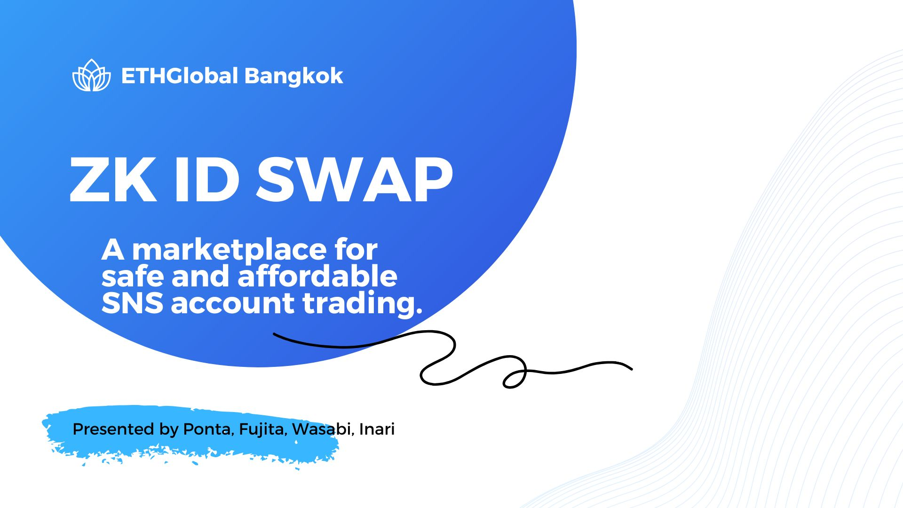
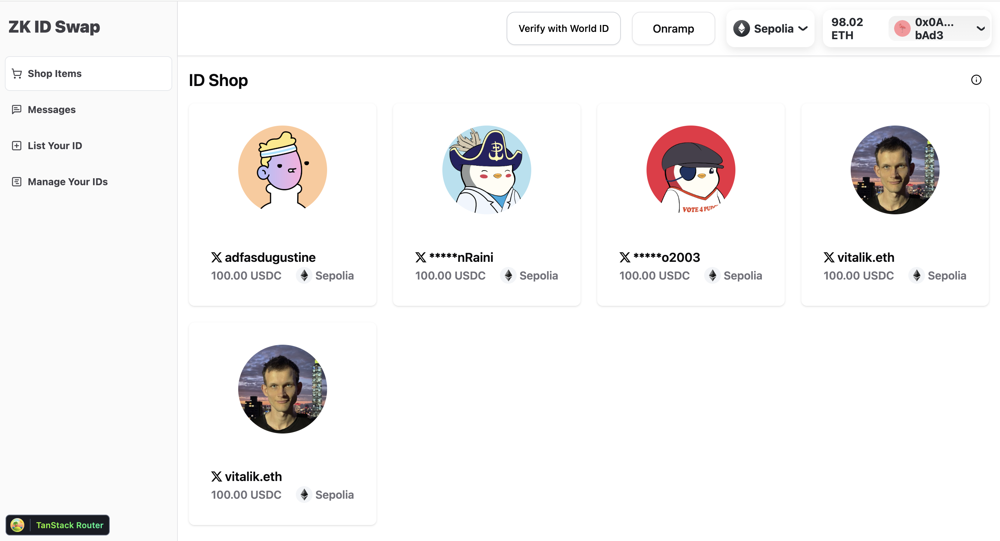

ZK ID Swap is a blockchain-based marketplace designed for the secure and affordable trading of SNS accounts. Leveraging zkTLS technology, the platform verifies account ownership without exposing sensitive user information. Transactions are conducted via smart contracts with on-chain escrow, eliminating the need for intermediaries and ensuring transparency.

By removing traditional web2 middlemen, ZK ID Swap reduces fees and increases trust in the trading process. The platform is tailored to provide a seamless onboarding experience for web2 users, featuring web3Auth and cryptoless onboarding with MoonPay integration.

ZK ID Swap is ideal for influencers, businesses, and marketing professionals seeking a reliable, efficient way to buy or sell SNS accounts while embracing the advantages of web3 technology.


## Presentation Slide

[Presentation Slide](https://www.canva.com/design/DAGWnn3UXZs/0ul4tJ67Kogoa9mzJH9gkw/view?utm_content=DAGWnn3UXZs&utm_campaign=designshare&utm_medium=link&utm_source=editor)


## How It's made

ZK ID Swap combines cutting-edge technologies to create a secure and efficient SNS account trading marketplace. Here’s how we built it:

**zkTLS Integration (webProof by [vlayer](https://www.vlayer.xyz/)):**

We implemented zkTLS technology to securely verify SNS account ownership. This allows smart contracts to validate Twitter IDs directly, ensuring transparent and trustless transactions.

**[Push Protocol Chat](https://push.org/):**

A secure chat feature built with Push Protocol enables users to exchange credentials like IDs and passwords without exposing them to intermediaries, preserving privacy.

**[Web3Auth](https://web3auth.io/) for Wallet Integration:**

Web3Auth simplifies onboarding for non-crypto users by providing an easy-to-use wallet solution, bridging the gap between web2 and web3.

**[USDC](https://www.circle.com/usdc) as the Transaction Currency:**

By adopting USDC, we ensure stable, reliable transactions that are familiar to crypto and non-crypto users alike.

**[MoonPay](https://www.moonpay.com/) as an Onramp Solution:**

Users who have completed KYC through MoonPay can purchase USDC via credit card.

**[World ID](https://ja-jp.world.org/world-id) for Humanity Verification:**

World ID adds an additional layer of security by verifying users' humanity, discouraging malicious behavior and building trust within the ecosystem.


## DEMO Movie

To be provided at a later date when ready.

## SmartContract

| Chain                   | Prover Contract                                                                                                             | ZkVerifiedEscrow Contract                                                                                                       |
| :----------------------- | --------------------------------------------------------------------------------------------------------------------------: | -----------------------------------------------------------------------------------------------------------------------: |
| Ethereum Sepolia         | [0xd9a9364b3c1031685e68b821ceeb48ebc86685a0](https://eth-sepolia.blockscout.com/address/0xD9A9364B3c1031685e68b821cEEB48eBc86685a0) | [0x9c450d72fecd4700e7a08d7ce0c60541a7aa6bd9](https://eth-sepolia.blockscout.com/address/0x9c450d72fecd4700e7a08d7ce0c60541a7aa6bd9)                         |
| Base Sepolia           | [0x1a0bbb6afabfefcdb3e4fcad452aba1380bd890c](https://base-sepolia.blockscout.com/address/0x1a0bbb6afabfefcdb3e4fcad452aba1380bd890c) | [0x5420a342f6b74c75b67d2fcc4a2b8691c7627433](https://base-sepolia.blockscout.com/address/0x5420a342f6b74c75b67d2fcc4a2b8691c7627433)                         |
| Scroll Sepolia        | [0xdd039a26c36ad16c071deb8a20c32805af48f5a2f210fc2c7476508f0bf2446b](https://sepolia.scrollscan.com/tx/0xdd039a26c36ad16c071deb8a20c32805af48f5a2f210fc2c7476508f0bf2446b) | [0xExampleVerifierRootStock](https://explorer.testnet.rootstock.io/address/0xExampleVerifierRootStock)                 |
| Polygon Amoy            | [0x1a0bbb6afabfefcdb3e4fcad452aba1380bd890c](https://amoy.polygonscan.com/address/0x1a0bbb6afabfefcdb3e4fcad452aba1380bd890c) | [0x5420a342f6b74c75b67d2fcc4a2b8691c7627433](https://amoy.polygonscan.com/address/0x1a0bbb6afabfefcdb3e4fcad452aba1380bd890c)                           |

# How to build



## install

```
git clone https://github.com/pontech-dev/zk-id-swap.git

cd zk-id-swap

forge build

cd vlayer-react

bun install

bun run deploy:testnet
```

## update .env

Add and configure the necessary environment variables

```
VITE_ZERODEV_PAYMASTER_URL=

# get both values from https://developer.worldcoin.org
VITE_WLD_APP_ID=
VITE_WLD_ACTION=
VITE_PROVER_ADDRESS=
VITE_VERIFIER_ADDRESS=
VITE_CHAIN_NAME=
VITE_PROVER_URL=
VITE_JSON_RPC_URL=
VITE_PRIVATE_KEY=
```

## Start

```
bun run dev
```
